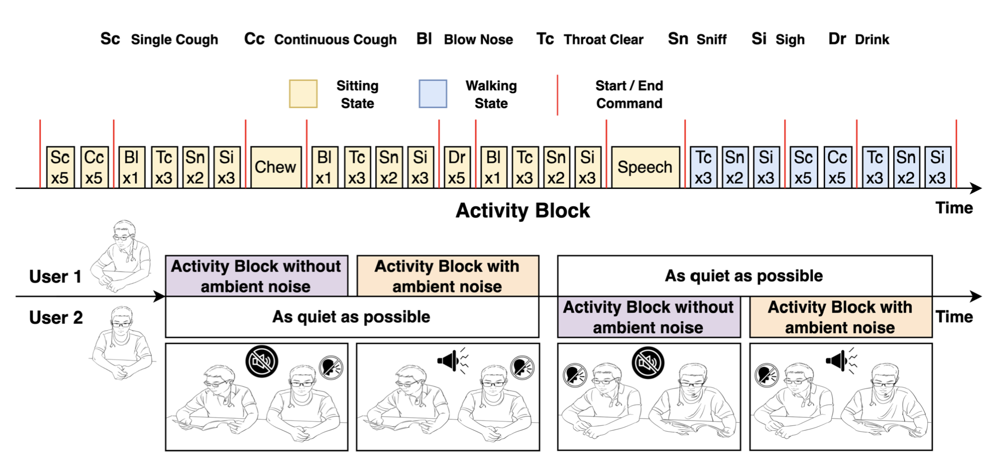
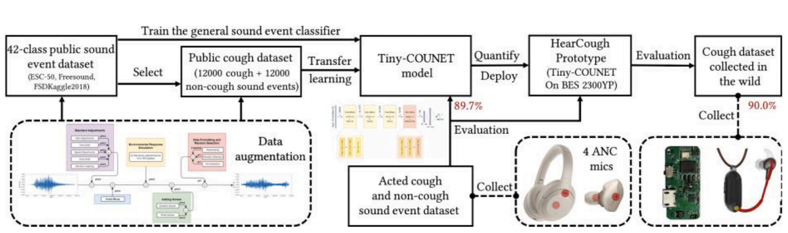
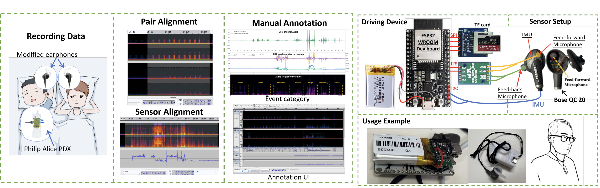
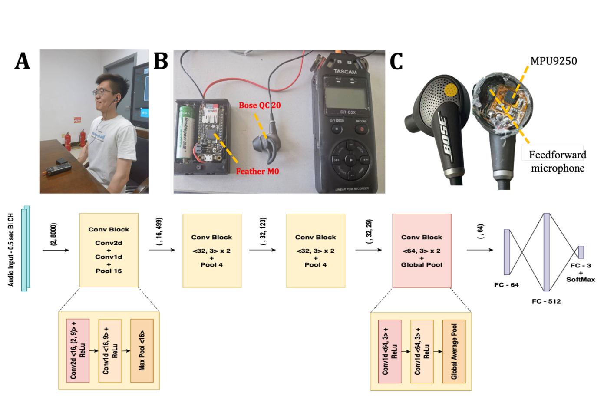
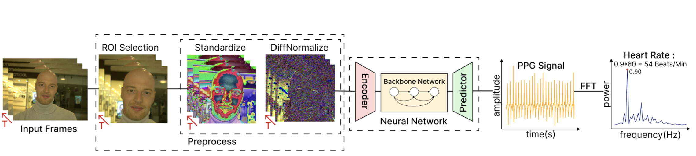
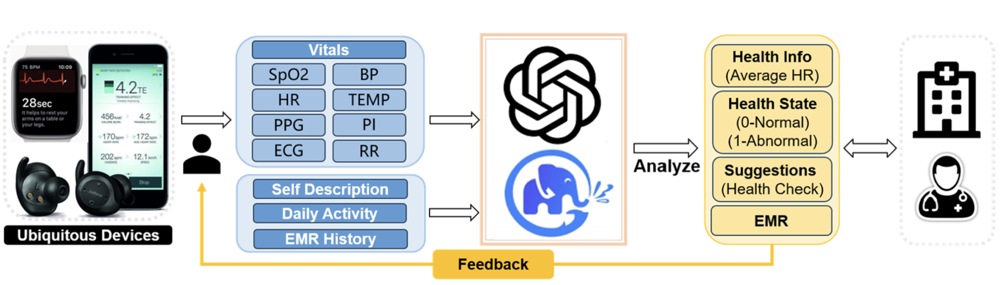








Xiyuxing Zhang is a Ph.D. student in the [Pervasive Interaction Lab](https://pi.cs.tsinghua.edu.cn/) at Tsinghua University, advised by [Prof. Yuanchun Shi](https://scholar.google.com/citations?user=TZm3-pwAAAAJ), [A/Prof. Yuntao Wang](https://scholar.google.com/citations?user=kHpwoAUAAAAJ). His research focuses on ubiquitous computing and HCI with healthcare using wearables. 

His research interest includes:

- Wearable Computing
- Health Sensing and Intervention Techniques
- On-device Machine Learning / Tiny-ML

# 🔥 News
- **2024.09**: &nbsp;🎉🎉 Our dataset paper DreamCatcher: A Wearer-aware Multi-modal Sleep Event Dataset Based on Earables in Non-restrictive Environments is accepted by [Neurips 2024](https://neurips.cc/) as a spotlight!!!
- **2024.09**: &nbsp;🎉🎉 I am awarded **Deng Feng Scholarship** from Tsinghua University!!!
- **2024.04**: &nbsp;🎉🎉 Our dataset paper [The EarSAVAS Dataset: Enabling Subject-Aware Vocal Activity Sensing on Earables](https://dl.acm.org/doi/10.1145/3659616) is accepted by [IMWUT 2024](https://www.ubicomp.org/ubicomp-iswc-2024/imwut_papers/)!!!
- **2023.04**: Attending [CHI 2023](https://chi2023.acm.org/) and present our work [EarCough: Enabling Continuous Subject Cough Event Detection on Hearables](https://dl.acm.org/doi/abs/10.1145/3544549.3585903)!!!
- **2023.02**: &nbsp;🎉🎉 Our paper [EarCough](https://dl.acm.org/doi/abs/10.1145/3544549.3585903), about efficient cough detection with the interference of bystanders is accepted by [CHI '23](https://chi2023.acm.org/)!!!
- **2022.09**: My journey at Tsinghua as a Ph.D. student is started!!!
- **2022.06**: &nbsp;🎉🎉 Awarded **Outstanding Undergraduate Thesis Honor** by Tsinghua University!!!
- **2022.05**: &nbsp;🎉🎉 My first research paper about [cough detection on earables](https://www.sciencedirect.com/science/article/pii/S1046202322001165) has been accepted by [Methods](https://www.sciencedirect.com/journal/methods)!!!

# 📝 Publications 
### JOURNAL PUBLICATIONS

IMWUT

  
## The EarSAVAS Dataset: Enabling Subject-Aware Vocal Activity Sensing on Earables 

**Xiyuxing Zhang**, Yuntao Wang, Yuxuan Han, Chen Liang, Ishan Chatterjee, Jiankai Tang, Xin Yi, Shwetak Patel, and Yuanchun Shi

[IMWUT](http://imwut.acm.org/). 

    <a class="_blank" href="https://dl.acm.org/doi/10.1145/3659616" >
        <i class="fas fa-newspaper" aria-hidden="true"></i> Paper
    </a>
  <a class="_blank" href="https://github.com/thuhci/EarSAVAS">
        <i class="ai ai-open-access ai-1x" aria-hidden="true"></i> Code
    </a>

Methods

<!-- --------------------------------------------------------------------------------------------------------------- -->

## HearCough: Enabling continuous cough event detection on edge computing hearables.

Yuntao Wang\*, **Xiyuxing Zhang\***(\*Co-first Author), Jay M Chakalasiya\*, Xuhai Xu, Yu Jiang, Yuang Li, Shwetak Patel, Yuanchun Shi

[Methods](https://www.sciencedirect.com/journal/methods). 

    <a class="_blank" href="https://www.sciencedirect.com/science/article/pii/S1046202322001165" >
        <i class="fas fa-newspaper" aria-hidden="true"></i> Paper
    </a>

<!-- --------------------------------------------------------------------------------------------------------------- -->

#### CONFERENCE PUBLICATIONS

<!-- --------------------------------------------------------------------------------------------------------------- -->

Neurips 2024 Spotlight

## DreamCatcher: A Wearer-aware Multi-modal Sleep Event Dataset Based on Earables in Non-restrictive Environments

Zeyu Wang\*, **Xiyuxing Zhang\***(\*Co-first Author), Ruotong Yu\*, Yuntao Wang, Kenneth Christofferson, Jingru Zhang, Alex Mariakakis, Yuanchun Shi

[NIPS '24 Spotlight](https://neurips.cc/)

    <a class="_blank">
        <i class="fas fa-newspaper" aria-hidden="true"></i> Paper (To appear)
    </a>

<!-- --------------------------------------------------------------------------------------------------------------- -->

<!-- --------------------------------------------------------------------------------------------------------------- -->

CHI 2023

## EarCough: Enabling Continuous Subject Cough Event Detection on Hearables

**Xiyuxing Zhang**, Yuntao Wang, Jingru Zhang, Yaqing Yang, Shwetak Patel, Yuanchun Shi

[CHI EA '23](https://dl.acm.org/doi/proceedings/10.1145/3544549)

    <a class="_blank" href="https://dl.acm.org/doi/abs/10.1145/3544549.3585903" >
        <i class="fas fa-newspaper" aria-hidden="true"></i> Paper
    </a>

<!-- --------------------------------------------------------------------------------------------------------------- -->

<!-- --------------------------------------------------------------------------------------------------------------- -->

PhysioCHI 2024

## Camera-Based Remote Physiology Sensing for Hundreds of Subjects Across Skin Tones 

Jiankai Tang\*, Xinyi Li\*(\*Co-first Author), Jiacheng Liu, **Xiyuxing Zhang**, Zeyu Wang, Yuntao Wang

[CHI Workshop PhysioCHI 2024](https://chi2024.acm.org/for-authors/workshops/accepted-workshops/). 

    <a class="_blank" href="https://arxiv.org/abs/2404.05003" >
        <i class="fas fa-newspaper" aria-hidden="true"></i> Paper
    </a>
      <a class="_blank" href="https://github.com/Health-HCI-Group/Largest_rPPG_Dataset_Evaluation">
        <i class="ai ai-open-access ai-1x" aria-hidden="true"></i> Code
    </a>

<!-- --------------------------------------------------------------------------------------------------------------- -->

AI Health Summit 2023

## ALPHA: AnomaLous Physiological Health Assessment Using Large Language Models 

Jiankai Tang, Kegang Wang, Hongming Hu, **Xiyuxing Zhang**, Peiyu Wang, Xin Liu, Yuntao Wang

[AI Health Summit 2023](https://healthsummit.ai/main/abstracts/). 

    <a class="_blank" href="https://arxiv.org/abs/2311.12524" >
        <i class="fas fa-newspaper" aria-hidden="true"></i> Paper
    </a>
      <a class="_blank" href="https://github.com/McJackTang/LLM-HealthAssistant">
        <i class="ai ai-open-access ai-1x" aria-hidden="true"></i> Code
    </a>

# 🎖 Honors and Awards
- *2024* **Deng Feng Scholarship**, Tsinghua University.
- *2023* **Special Recognitions for Outstanding Reviews**, 2 recognitions for CHI 2024 Papers.
- *2022* **Outstanding Undergraduate Thesis Honor**, Tsinghua University.
- *2022* **The Honorable Medal in the Collegiate Computer System & Programing contest**, China Computer Federation (CCF)
- *2021* **Comprehensive Excellence Scholarship**, Tsinghua University

# 📖 Educations
- *2022.09 - 2027.06 (expected)*, Ph.D. in Department of Computer Science and Technology, Tsinghua University.
- *2018.09 - 2022.06*, B.S. in Department of Computer Science and Technology, Tsinghua University. 

# 💬 Invited Talks
- *2022.10*, "Can smart earphones hear your cough?", Colloquium of Xinya College, Tsinghua University 

# 💻 Internships
- *2023.05 - 2023.08*, [MainTrend Capital](http://www.maintrendcapital.com/), China.

# 👨🏻‍🎓 Teaching Experience
- *2022.09 - 2023.01*, Teaching Assistant of "Embedded System" (40240552), Tsinghua University.
- *2023.09 - 2024.01*, Teaching Assistant of "Embedded System" (40240552), Tsinghua University.
- *2024.09 - 2025.01*, Teaching Assistant of "Embedded System" (40240552), Tsinghua University.
- *2024.09 - 2025.01*, Teaching Assistant of "Essentials to Signal Processing and Data Management for AIoT Applications" (86010053), Tsinghua University.

# 💗 Professional Services
- Conference Reviewers: IMWUT 2023 November, IMWUT 2023 August, IMWUT 2024 May, CHI 2024, CHI 2025
- Special Recognitions for Outstanding Reviews, 2 recognitions for CHI 2024 Papers.