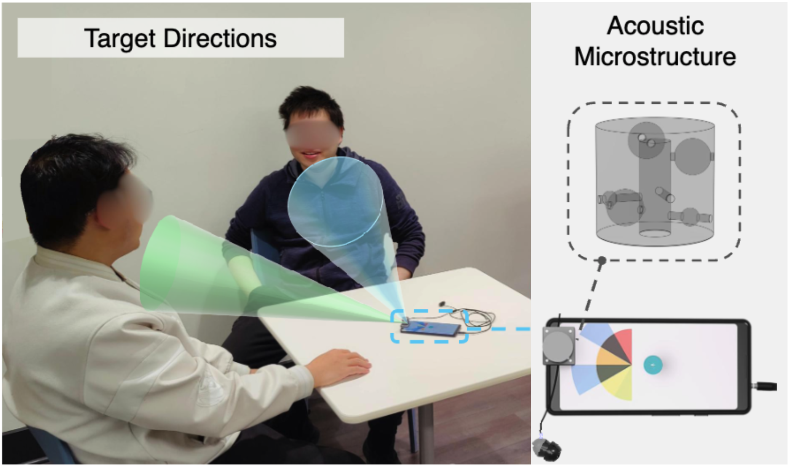
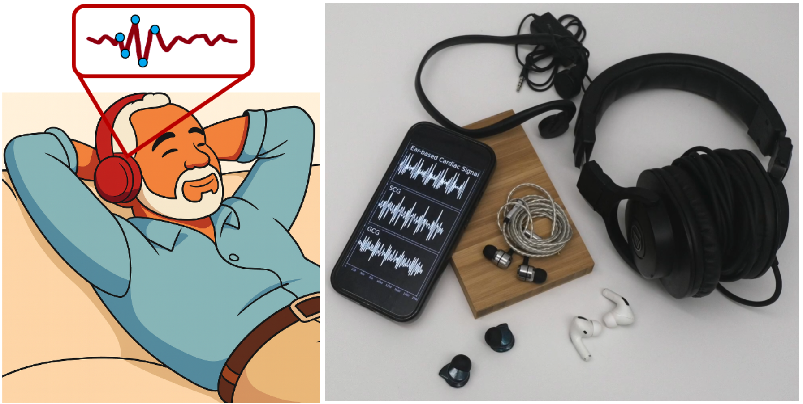
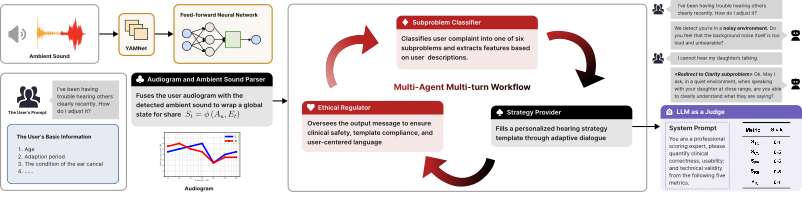
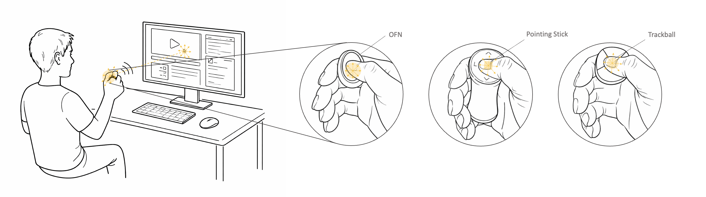
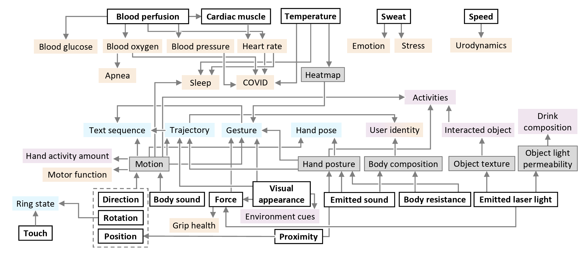








Xiyuxing Zhang is a Ph.D. Candidate in the [Pervasive Interaction Lab](https://pi.cs.tsinghua.edu.cn/) at Tsinghua University, advised by [Prof. Yuanchun Shi](https://scholar.google.com/citations?user=TZm3-pwAAAAJ) and [A/Prof. Yuntao Wang](https://scholar.google.com/citations?user=kHpwoAUAAAAJ). He is also honored to collaborate with [Prof. Justin Chan](https://scholar.google.com/citations?user=dpyzXwMAAAAJ) in the [Semantic Signals Lab](https://semanticsignals.com/) at Carnegie Mellon University. His research focuses on ubiquitous computing and HCI with healthcare using wearables. 

His research interest includes:

- Wearable Computing
- Sensing supported HealthCare Delivery
- On-device Machine Learning / Tiny-ML

# 🔥 News

- **2026.6**: Invited to serve on the Technical Program Committee (TPC) for the Notes and Briefs track of UbiComp/ISWC 2026.
- **2026.5**: Invited to serve as a member of Artifact Evaluation Committee for [MobiCom 2026](https://www.sigmobile.org/mobicom/2026/).
- **2026.4**: Co-organizing the 1st  Workshop on Hot Topics in Mobile and Wireless Systems for Health at MobiCom 2026, Austin, TX. Please consider submitting your work!!!
- **2026.2**: &nbsp;🎉🎉 Two of our papers have been accepted by [ACM CHI EA '26](https://chi2026.acm.org/)!!!
- **2026.1**: &nbsp;🎉🎉 Our paper [SonicSieve](https://arxiv.org/abs/2504.10793) and [LubdubDecoder](https://arxiv.org/abs/2509.10764) have been accepted by [ACM CHI'26](https://chi2026.acm.org/).
- **2025.12**: &nbsp;🎉🎉 Honored to receive [Outstanding Teaching Assistant Award](https://mp.weixin.qq.com/s/Esu36IaaQX1toLzvidCd2w) of Tsinghua University!!!
- **2025.12**: &nbsp;🎉🎉 Honored to be supported by **China Association for Science and Technology’s Young Elite Scientists Sponsorship Program** (Doctoral Student Special Project)!!!
- **2025.11**: &nbsp;🎉🎉 Awarded the **Third Prize** in the 4th Tsinghua Medicine x Engineering Competition (Translation Track) as the Project Leader for our work on Earable Sleep Management (one of only **7 winning teams out of 52**)!!!
- **2025.10**: &nbsp;🎉🎉 Honored to receive the Tsinghua Friends — Qidong Talent First-class Scholarship!!!
- **2025.09**: I will serve as a Student Volunteer (SV) at [Ubicomp'25](https://ubicomp.hosting.acm.org/ubicompiswc2025_wp/). Feel free to reach out in Espoo, Finland 🇫🇮!!!
- **2025.07**: &nbsp;🎉🎉 Two paper have been accetped by [IMWUT 2025](https://ubicomp.hosting.acm.org/ubicompiswc2025_wp/)!!! 
- **2025.01**: &nbsp;🎉🎉 Honored to become a **Visiting Scholar** at CMU (honored to be hosted by [Prof. Justin Chan](https://scholar.google.com/citations?user=dpyzXwMAAAAJ))!!!
- **2024.11**: Awarded the **First Prize** in [Ubiquitous Intelligent Sensing Technology Innovation Application Competition](https://mp.weixin.qq.com/s/MtOsxOmLhCCS2es1rDuPRQ) (Top 5).
- **2024.10**: &nbsp;🎉🎉 Present our work on [Ubicomp'24](https://www.ubicomp.org/ubicomp-iswc-2024/): [The EarSAVAS Dataset: Enabling Subject-Aware Vocal Activity Sensing on Earables](https://dl.acm.org/doi/10.1145/3659616)!!!
- **2024.09**: &nbsp;🎉🎉 DreamCatcher: A Wearer-aware Multi-modal Sleep Event Dataset Based on Earables in Non-restrictive Environments have been accepted by [Neurips 2024](https://neurips.cc/) as a spotlight!!!
- **2024.09**: &nbsp;🎉🎉 I am awarded **Deng Feng Scholarship** from Tsinghua University!!!
- **2024.04**: &nbsp;🎉🎉 [The EarSAVAS Dataset: Enabling Subject-Aware Vocal Activity Sensing on Earables](https://dl.acm.org/doi/10.1145/3659616) have been accepted by [IMWUT 2024](https://www.ubicomp.org/ubicomp-iswc-2024/imwut_papers/)!!!
- **2023.04**: Attend [CHI 2023](https://chi2023.acm.org/) and present our work [EarCough: Enabling Continuous Subject Cough Event Detection on Hearables](https://dl.acm.org/doi/abs/10.1145/3544549.3585903)!!!
- **2023.02**: &nbsp;🎉🎉 Our paper [EarCough](https://dl.acm.org/doi/abs/10.1145/3544549.3585903), about efficient cough detection with the interference of bystanders have been accepted by [CHI '23](https://chi2023.acm.org/)!!!
- **2022.09**: My journey at Tsinghua as a Ph.D. student is started!!!
- **2022.06**: &nbsp;🎉🎉 Awarded [**Outstanding Undergraduate Thesis Honor**](https://mp.weixin.qq.com/s/45pzmidzvKVf9eHgtrMS7Q) by Tsinghua University!!!
- **2022.05**: &nbsp;🎉🎉 My first research paper about [cough detection on earables](https://www.sciencedirect.com/science/article/pii/S1046202322001165) has been accepted by [Methods](https://www.sciencedirect.com/journal/methods)!!!

# 📝 Publications 

### CONFERENCE PUBLICATIONS

CHI 2026

## SonicSieve: Bringing Directional Speech Extraction to Smartphones Using Acoustic Microstructures

Kuang Yuan\*, Yifeng Wang\*, **Xiyuxing Zhang\***(\*Co-first Author), Chengyi Shen, Swarun Kumar, Justin Chan

[CHI '26](https://chi2026.acm.org/)

    <a class="_blank" href="https://arxiv.org/abs/2504.10793" >
        <i class="fas fa-newspaper" aria-hidden="true"></i> Paper
    </a>
    &nbsp;
    <a class="_blank" href="https://youtu.be/ZXxkLvVxmDo">
        <i class="fas fa-video" aria-hidden="true"></i> Video
    </a>

CHI 2026

## LubDubDecoder: Bringing Micro-Mechanical Cardiac Monitoring to Hearables

Siqi Zhang\*, **Xiyuxing Zhang\***(\*Co-first Author), Duc Vu\*, Tao Qiang\*, Clara Palacios, Jiangyifei Zhu, Yuntao Wang, Mayank Goel, Justin Chan

[CHI '26](https://chi2026.acm.org/)

    <a class="_blank" href="https://arxiv.org/abs/2509.10764" >
        <i class="fas fa-newspaper" aria-hidden="true"></i> Paper
    </a>
    &nbsp;
    <a class="_blank" href="https://www.youtube.com/watch?v=_73TTL4x3Fo">
        <i class="fas fa-video" aria-hidden="true"></i> Video
    </a>

<!-- --------------------------------------------------------------------------------------------------------------- -->

Neurips 2024 Spotlight

## DreamCatcher: A Wearer-aware Multi-modal Sleep Event Dataset Based on Earables in Non-restrictive Environments

Zeyu Wang\*, **Xiyuxing Zhang\***(\*Co-first Author), Ruotong Yu\*, Yuntao Wang, Kenneth Christofferson, Jingru Zhang, Alex Mariakakis, Yuanchun Shi

[NeurIPS '24 Spotlight](https://neurips.cc/)

    <a class="_blank" href="https://neurips.cc/virtual/2024/poster/97709" >
        <i class="fas fa-newspaper" aria-hidden="true"></i> Paper
    </a>
    <a class="_blank" href="https://huggingface.co/datasets/THU-PI-Sensing/DreamCatcher/tree/main">
        <i class="ai ai-open-access ai-1x" aria-hidden="true"></i> Dataset
    </a>
    <a class="_blank" href="https://github.com/thuhci/DreamCatcher">
        <i class="ai ai-open-access ai-1x" aria-hidden="true"></i> Code
    </a>

<!-- --------------------------------------------------------------------------------------------------------------- -->

<!-- --------------------------------------------------------------------------------------------------------------- -->

CHI 2023

## EarCough: Enabling Continuous Subject Cough Event Detection on Hearables

**Xiyuxing Zhang**, Yuntao Wang, Jingru Zhang, Yaqing Yang, Shwetak Patel, Yuanchun Shi

[CHI EA '23](https://dl.acm.org/doi/proceedings/10.1145/3544549)

    <a class="_blank" href="https://dl.acm.org/doi/abs/10.1145/3544549.3585903" >
        <i class="fas fa-newspaper" aria-hidden="true"></i> Paper
    </a>

Ubicomp 2025

## Context-Adaptive Hearing Aid Fitting Advisor through Multi-turn Multimodal LLM Conversation

Yingke Ding, Zeyu Wang, **Xiyuxing Zhang**, Hongbin Chen, Zhenan Xu

[UbiComp Companion 2025](https://www.ubicomp.org/ubicomp-iswc-2025/)

    <a class="_blank" href="https://dl.acm.org/doi/10.1145/3714394.3750600" >
        <i class="fas fa-newspaper" aria-hidden="true"></i> Paper
    </a>

<!-- --------------------------------------------------------------------------------------------------------------- -->

<!-- --------------------------------------------------------------------------------------------------------------- -->

PhysioCHI 2024

## Camera-Based Remote Physiology Sensing for Hundreds of Subjects Across Skin Tones 

Jiankai Tang\*, Xinyi Li\*(\*Co-first Author), Jiacheng Liu, **Xiyuxing Zhang**, Zeyu Wang, Yuntao Wang

[CHI Workshop PhysioCHI 2024](https://chi2024.acm.org/for-authors/workshops/accepted-workshops/)

    <a class="_blank" href="https://arxiv.org/abs/2404.05003" >
        <i class="fas fa-newspaper" aria-hidden="true"></i> Paper
    </a>
      <a class="_blank" href="https://github.com/Health-HCI-Group/Largest_rPPG_Dataset_Evaluation">
        <i class="ai ai-open-access ai-1x" aria-hidden="true"></i> Code
    </a>

<!-- --------------------------------------------------------------------------------------------------------------- -->

AI Health Summit 2023

## ALPHA: AnomaLous Physiological Health Assessment Using Large Language Models 

Jiankai Tang, Kegang Wang, Hongming Hu, **Xiyuxing Zhang**, Peiyu Wang, Xin Liu, Yuntao Wang

[AI Health Summit 2023](https://healthsummit.ai/main/abstracts/)

    <a class="_blank" href="https://arxiv.org/abs/2311.12524" >
        <i class="fas fa-newspaper" aria-hidden="true"></i> Paper
    </a>
      <a class="_blank" href="https://github.com/McJackTang/LLM-HealthAssistant">
        <i class="ai ai-open-access ai-1x" aria-hidden="true"></i> Code
    </a>

<!-- --------------------------------------------------------------------------------------------------------------- -->

CHI EA 2026

## Control at Your Fingertips: How Close Are We to Effective Ring-Based Interaction?

Lily Sheng, Xingjian Tian, Ruotong Yu, **Xiyuxing Zhang**, Yuntao Wang, Yuanchun Shi

[CHI EA '26](https://chi2026.acm.org/)

    <a class="_blank" href="https://dl.acm.org/doi/full/10.1145/3772363.3798357" >
        <i class="fas fa-newspaper" aria-hidden="true"></i> Paper
    </a>

<!-- --------------------------------------------------------------------------------------------------------------- -->

<!-- --------------------------------------------------------------------------------------------------------------- -->

CHI EA 2026

## 3D-MAGIC: Expanding MAGIC Pointing to Stereoscopic Displays

Xingjian Tian, Lily Sheng, **Xiyuxing Zhang**, Xingru Chen, Fangfei Gou, Zhenzhou Zhang, Wanjun Lv, Liuxin Zhang, Yuntao Wang, Yuanchun Shi

[CHI EA '26](https://chi2026.acm.org/)

    <a class="_blank" href="https://dl.acm.org/doi/full/10.1145/3772363.3798896" >
        <i class="fas fa-newspaper" aria-hidden="true"></i> Paper
    </a>

<!-- --------------------------------------------------------------------------------------------------------------- -->

### JOURNAL PUBLICATIONS

IMWUT

## The EarSAVAS Dataset: Enabling Subject-Aware Vocal Activity Sensing on Earables 

**Xiyuxing Zhang**, Yuntao Wang, Yuxuan Han, Chen Liang, Ishan Chatterjee, Jiankai Tang, Xin Yi, Shwetak Patel, and Yuanchun Shi

[IMWUT](http://imwut.acm.org/)

    <a class="_blank" href="https://dl.acm.org/doi/10.1145/3659616" >
        <i class="fas fa-newspaper" aria-hidden="true"></i> Paper
    </a>
  <a class="_blank" href="https://github.com/thuhci/EarSAVAS">
        <i class="ai ai-open-access ai-1x" aria-hidden="true"></i> Code
    </a>

Methods

<!-- --------------------------------------------------------------------------------------------------------------- -->

## HearCough: Enabling continuous cough event detection on edge computing hearables.

Yuntao Wang\*, **Xiyuxing Zhang\***(\*Co-first Author), Jay M Chakalasiya\*, Xuhai Xu, Yu Jiang, Yuang Li, Shwetak Patel, Yuanchun Shi

[Methods](https://www.sciencedirect.com/journal/methods)

    <a class="_blank" href="https://www.sciencedirect.com/science/article/pii/S1046202322001165" >
        <i class="fas fa-newspaper" aria-hidden="true"></i> Paper
    </a>

IMWUT

## Computing with Smart Rings: A Systematic Literature Review

Zeyu Wang, Ruotong Yu, Xiangyang Wang, Jiexin Ding, Jiankai Tang, Jun Fang, Zhe He, Zhuojun Li, Tobias Röddiger, Weiye Xu, **Xiyuxing Zhang**, Nan Gao, Chun Yu, Yuanchun Shi, Yuntao Wang

[IMWUT](http://imwut.acm.org/)

    <a class="_blank" href="https://dl.acm.org/doi/10.1145/3659616" >
        <i class="fas fa-newspaper" aria-hidden="true"></i> Paper
    </a>

<!-- --------------------------------------------------------------------------------------------------------------- -->

# 🎖 Honors and Awards
- *2025* **China Association for Science and Technology’s Young Elite Scientists Sponsorship Program (Doctoral Student Special Project, National-level Talent Program)**, China.
- *2025* **Outstanding Teaching Assistant Award**, Tsinghua University.
- *2025* **Third Prize** in the 4th Tsinghua Medicine x Engineering Competition (Translation Track, Project Leader, Ranked 4 out of 52).
- *2025* **Tsinghua Friends - Qidong Talent First-class Scholarship**, Tsinghua University.
- *2024* **First Prize** in [Ubiquitous Intelligent Sensing Technology Innovation Application Competition](https://mp.weixin.qq.com/s/MtOsxOmLhCCS2es1rDuPRQ) (Top 5).
- *2024* **Special Recognitions for Outstanding Reviews**, 1 recognition for CHI 2025 Papers.
- *2024* **Deng Feng Scholarship**, Tsinghua University.
- *2023* **Special Recognitions for Outstanding Reviews**, 2 recognitions for CHI 2024 Papers.
- *2022* **Outstanding Undergraduate Thesis Honor**, Tsinghua University.
- *2022* **The Honorable Medal in the Collegiate Computer System & Programing contest**, China Computer Federation (CCF)
- *2021* **Comprehensive Excellence Scholarship**, Tsinghua University

# 📖 Educations
- *2022.09 - 2027.06 (expected)*, Ph.D. in Department of Computer Science and Technology, Tsinghua University.
- *2018.09 - 2022.06*, B.S. in Department of Computer Science and Technology, Tsinghua University. 

# 💬 Invited Talks
- *2025.1*, ["Continuous Health Sensing and Just-In-Time Adaptive Interventions on Commodity Earables"](https://mp.weixin.qq.com/s/nGURsP5dae3qyKPOfY1T2Q), YIZHE AI
- *2022.10*, ["Can smart earphones hear your cough?"](https://mp.weixin.qq.com/s/gNdOYRXfQ_fMy39rV3-DcA), Colloquium of Xinya College, Tsinghua University 

# 💻 Internships

- *2023.05 - 2023.08*, [MainTrend Capital](http://www.maintrendcapital.com/), China.

# 👨🏻‍🎓 Teaching Experience
- *2022.09 - 2023.01*, Teaching Assistant of "Embedded System" (40240552), Tsinghua University.
- *2023.09 - 2024.01*, Teaching Assistant of "Embedded System" (40240552), Tsinghua University.
- *2024.09 - 2025.01*, Teaching Assistant of "Embedded System" (40240552), Tsinghua University.
- *2024.09 - 2025.01*, Teaching Assistant of "Essentials to Signal Processing and Data Management for AIoT Applications" (86010053), Tsinghua University. (Outstanding Teaching Assistant Award, University Level)
- *2025.09 - 2026.01*, Teaching Assistant of "Essentials to Signal Processing and Data Management for AIoT Applications" (86010053), Tsinghua University.

# 💗 Professional Services
- Artifact Evaluation Committee of ACM MobiCom 2026
- Technical Program Committee for the Notes and Briefs track of UbiComp/ISWC 2026
- Student Volunteer of Ubicomp 2025
- Reviewers of IMWUT 2023, IMWUT 2024, IMWUT 2025, ISWC 2025, CHI 2024, CHI 2025, CHI 2026, UIST 2026
- Special Recognitions for Outstanding Reviews, 2 recognitions for CHI 2024 & 1 for CHI 2025 paper & 1 for CHI 2026 & 3 for IMWUT 2025 & 1 for ISWC Briefs and Notes 2025